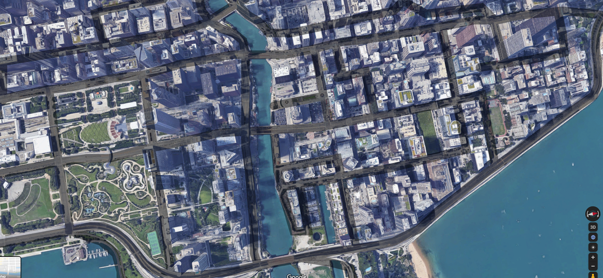

# Self-Driving Car with TD3 Reinforcement Learning

A self-driving car simulation that uses the Twin Delayed Deep Deterministic Policy Gradient (TD3) algorithm to learn optimal driving behavior. The car learns to navigate through a custom environment while avoiding obstacles and reaching target points.

## Features

- Real-time visualization using Kivy
- Interactive sand/dirt area drawing for creating custom tracks
- Multiple target points for the car to reach
- Sensor-based obstacle detection
- TD3 reinforcement learning implementation
- Save and load functionality for trained models
- Performance tracking and evaluation metrics

## Environment Visualization

The simulation uses two main images for the environment:

### City Map


### Mask for Road & Obstacles


## Requirements

- Python 3.7+
- PyTorch
- Kivy
- NumPy
- Matplotlib
- PIL (Python Imaging Library)

## Installation

1. Clone the repository:
```bash
git clone https://github.com/dbvb2k/DBVB-ERAV3-S21
cd self-driving-car-td3
```

2. Install the required packages:
```bash
pip install torch numpy kivy matplotlib pillow
```

## Usage

1. Run the simulation:
```bash
python map.py
```

2. Use the interface:
   - Left-click and drag to draw sand/dirt areas (obstacles)
   - Use the 'clear' button to reset the track
   - Use the 'save' button to save the trained model
   - Use the 'load' button to load a previously saved model

3. The car will automatically start learning to navigate the environment and reach the target points.

## Project Structure

- `map.py`: Main simulation file containing the game logic and visualization
- `td3.py`: Implementation of the TD3 algorithm
- `images/`: Directory containing required image files
  - `MASK1.png`: Sensor mask for the car
  - `mask.png`: Base map for the environment
  - `sand.jpg`: Generated sand/dirt areas

## TD3 Implementation Details

The TD3 (Twin Delayed Deep Deterministic Policy Gradient) implementation in `td3.py` includes several key components and improvements:

### Network Architecture
- Actor Network:
  - Input layer: state_dim → 32 neurons
  - Hidden layer: 32 → 16 neurons
  - Output layer: 16 → action_dim neurons
  - Uses ReLU activation and tanh output with max_action scaling

- Critic Networks (Twin):
  - Two identical networks for Q-value estimation
  - Input: state + action → 32 neurons
  - Hidden: 32 → 16 neurons
  - Output: 16 → 1 neuron (Q-value)
  - Uses ReLU activation

### Key Features
1. **Exploration Mechanism**:
   - Implements decaying exploration noise
   - Initial noise: 0.1
   - Decay rate: 0.995
   - Minimum noise: 0.01

2. **Training Stability**:
   - Gradient clipping (max norm: 1.0)
   - Delayed policy updates (every 2 iterations)
   - Target network soft updates (tau: 0.005)

3. **Optimization**:
   - Adam optimizer with learning rate: 3e-4
   - Batch size: 200
   - Discount factor: 0.99
   - Policy noise: 0.2
   - Noise clipping: 0.5

### Performance Tracking
- Tracks total timesteps
- Monitors episode rewards
- Evaluates performance every 5000 timesteps
- Saves and loads model checkpoints

## Training Process

The training process includes:
1. State observation (sensor readings + orientation)
2. Action selection with exploration
3. Environment interaction
4. Reward calculation
5. Experience storage in replay buffer
6. Batch training when sufficient samples are available
7. Periodic evaluation and performance reporting

## Performance Metrics

The system tracks and displays:
- Total timesteps
- Episode number
- Episode rewards
- Average reward over evaluation periods

## Contributing

Contributions are welcome! Please feel free to submit a Pull Request.

## License

This project is licensed under the MIT License - see the LICENSE file for details.

## Acknowledgments

- Based on the TD3 algorithm paper: "Addressing Function Approximation Error in Actor-Critic Methods"
- Uses Kivy for visualization
- Implements PyTorch for deep learning 